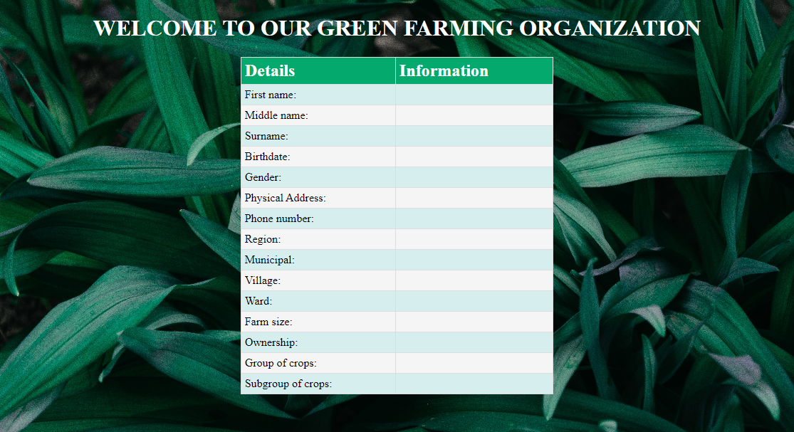

<!-- Improved compatibility of back-to-top link: See: https://github.com/othneildrew/Best-README-Template/pull/73 -->
<a name="readme-top"></a>


<!-- PROJECT SHIELDS -->

[![Contributors][contributors-shield]][contributors-url]
[![Forks][forks-shield]][forks-url]
[![Stargazers][stars-shield]][stars-url]
[![Issues][issues-shield]][issues-url]
[![MIT License][license-shield]][license-url]
[![LinkedIn][linkedin-shield]][linkedin-url]


<!-- PROJECT LOGO -->
<br />
<div align="center">

  <h3 align="center">Farmer's details on table view</h3>

  <p align="center">
    A simple table displaying farmer's information for farmer view their details.
    <br />
    <a href="https://github.com/slymackjr/form-table"><strong>Explore the docs »</strong></a>
    <br />
    <br />
    <a href="https://slymackjr.github.io/form-table/">View Demo</a>
    ·
    <a href="https://github.com/slymackjr/form-table/issues">Report Bug</a>
    ·
    <a href="https://github.com/slymackjr/form-table/issues">Request Feature</a>
  </p>
</div>


<!-- TABLE OF CONTENTS -->
<details>
  <summary>Table of Contents</summary>
  <ol>
    <li>
      <a href="#about-the-project">About The Project</a>
      <ul>
        <li><a href="#built-with">Built With</a></li>
      </ul>
    </li>
    <li>
      <a href="#getting-started">Getting Started</a>
      <ul>
        <li><a href="#prerequisites">Prerequisites</a></li>
        <li><a href="#installation">Installation</a></li>
      </ul>
    </li>
    <li><a href="#usage">Usage</a></li>
    <li><a href="#roadmap">Roadmap</a></li>
    <li><a href="#contributing">Contributing</a></li>
    <li><a href="#license">License</a></li>
    <li><a href="#contact">Contact</a></li>
    <li><a href="#acknowledgments">Acknowledgments</a></li>
  </ol>
</details>


<!-- ABOUT THE PROJECT -->
## About The Project

[![Product Name Screen Shot][product-screenshot]](https://example.com)

A simple table comprising of details of farmer recorded during registration period so as to see the form implementation of it worked perfectly in recording data.

<p align="right">(<a href="#readme-top">back to top</a>)</p>


### Built With

* [![HTML Version][HTML-shield]][HTML-url]
* [![CSS Version][CSS-shield]][CSS-url]


<p align="right">(<a href="#readme-top">back to top</a>)</p>


<!-- GETTING STARTED -->
## Getting Started

This is an example of how you may give instructions on setting up your project locally. To get a local copy up and running, follow these simple steps.
### Prerequisites

* Visual Studio code or any other editor is fine.

### Installation

1. Clone the repo
   ```sh
   git clone https://github.com/slymackjr/form-table.git
   ```

<p align="right">(<a href="#readme-top">back to top</a>)</p>
<!-- USAGE -->   

## Usage

This table is used for practice to show the implementation on forms and data retrieval from database.

<div style="overflow-x: auto; white-space: nowrap;">
  
</div>

<p align="right">(<a href="#readme-top">back to top</a>)</p>


<!-- ROADMAP -->
## Roadmap

- [x] Basic functionality for simple table view on a single page
- [ ] Multi-language Support
    - [ ] Swahili
    - [ ] English

See the [open issues](https://https://github.com/slymackjr/form-table/issues) for a full list of proposed features (and known issues).

<p align="right">(<a href="#readme-top">back to top</a>)</p>


<!-- CONTRIBUTING -->
## Contributing

Contributions are welcome! Follow the steps below:

1. Fork the Project
2. Create your Feature Branch (`git checkout -b feature/AmazingFeature`)
3. Commit your Changes (`git commit -m 'Add some AmazingFeature'`)
4. Push to the Branch (`git push origin feature/AmazingFeature`)
5. Open a Pull Request

<p align="right">(<a href="#readme-top">back to top</a>)</p>


<!-- LICENSE -->
## License

Distributed under the MIT License. See `LICENSE.txt` for more information.

<p align="right">(<a href="#readme-top">back to top</a>)</p>


<!-- CONTACT -->
## Contact

Jofrey Nyamasheki - [https://twitter.com/slymackjr](https://x.com/slymack_w?t=naiyIend2MU_qg-Tm4jQgw&s=09)
Project Link: [https://github.com/slymackjr/form-table](https://github.com/slymackjr/form-table)

<p align="right">(<a href="#readme-top">back to top</a>)</p>


<!-- ACKNOWLEDGMENTS -->
## Acknowledgments

I would like to thank these wonderful tools that enabled me to make it all happen.

* [Choose an Open Source License](https://choosealicense.com)
* [GitHub Emoji Cheat Sheet](https://www.webpagefx.com/tools/emoji-cheat-sheet)
* [Bootstrap](https://getbootstrap.com/)
* [SASS](https://sass-lang.com/)
* [Img Shields](https://shields.io)
* [GitHub Pages](https://pages.github.com)
* [Font Awesome](https://fontawesome.com)

<p align="right">(<a href="#readme-top">back to top</a>)</p>


<!-- MARKDOWN LINKS & IMAGES -->
<!-- https://www.markdownguide.org/basic-syntax/#reference-style-links -->
[contributors-shield]: https://img.shields.io/github/contributors/slymackjr/form-table.svg?style=for-the-badge&color=4EA94B
[contributors-url]: https://github.com/slymackjr/form-table/graphs/contributors
[forks-shield]: https://img.shields.io/github/forks/slymackjr/form-table.svg?style=for-the-badge
[forks-url]: https://github.com/slymackjr/form-table/network/members
[stars-shield]: https://img.shields.io/github/stars/slymackjr/form-table.svg?style=for-the-badge
[stars-url]: https://github.com/slymackjr/form-table/stargazers
[issues-shield]: https://img.shields.io/github/issues/slymackjr/form-table.svg?style=for-the-badge
[issues-url]: https://github.com/slymackjr/form-table/issues
[license-shield]: https://img.shields.io/github/license/slymackjr/form-table.svg?style=for-the-badge
[license-url]: https://github.com/slymackjr/form-table/blob/table/LICENSE.txt
[linkedin-shield]: https://img.shields.io/badge/-LinkedIn-black.svg?style=for-the-badge&logo=linkedin&colorB=555
[linkedin-url]: https://www.linkedin.com/in/jofrey-nyamasheki-9bb8781ab?utm_source=share&utm_campaign=share_via&utm_content=profile&utm_medium=android_app
[product-screenshot]: screenshots/image1.png
[Laravel.com]: https://img.shields.io/badge/Laravel-FF2D20?style=for-the-badge&logo=laravel&logoColor=white
[Laravel-url]: https://laravel.com
[Bootstrap.com]: https://img.shields.io/badge/Bootstrap-563D7C?style=for-the-badge&logo=bootstrap&logoColor=white
[Bootstrap-url]: https://getbootstrap.com
[Sass-shield]: https://img.shields.io/badge/Sass-v1.47.0-CC6699?style=for-the-badge&logo=sass&logoColor=white
[Sass-url]: https://sass-lang.com/
[HTML-shield]: https://img.shields.io/badge/HTML-v5-4EA94B?style=for-the-badge&logo=html5&logoColor=white
[HTML-url]: https://developer.mozilla.org/en-US/docs/Web/HTML
[PHP-shield]: https://img.shields.io/badge/PHP-v8.0-777BB4?style=for-the-badge&logo=php&logoColor=white
[PHP-url]: https://www.php.net/
[CSS-shield]: https://img.shields.io/badge/CSS-v3-1572B6?style=for-the-badge&logo=css3&logoColor=white
[CSS-url]: https://developer.mozilla.org/en-US/docs/Web/CSS
[JavaScript-shield]: https://img.shields.io/badge/JavaScript-ES6-F7DF1E?style=for-the-badge&logo=javascript&logoColor=black
[JavaScript-url]: https://developer.mozilla.org/en-US/docs/Web/JavaScript


